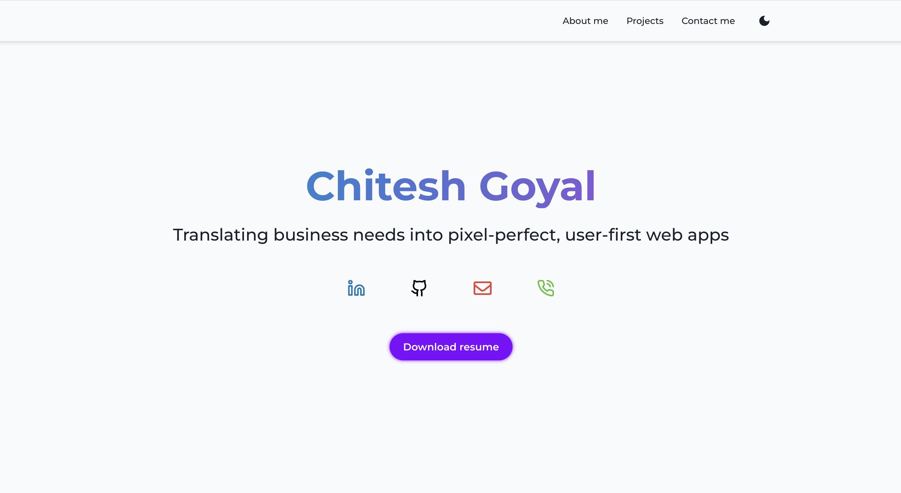

# 🌐 Chitesh Goyal - Portfolio Website

Welcome to my personal **portfolio website**, built with **ReactJS** and **Chakra UI**, to showcase my professional journey, skills, and projects.
This site highlights my **6+ years of experience** working on enterprise solutions as well as personal projects to demonstrate my front-end development expertise.

---

## 🚀 Features

- 🖥️ **Responsive Design** (mobile-first, accessible, dark mode supported)
- 📂 **Project Showcase** (enterprise & personal projects with case-study style details)
- 🧑‍💻 **About Me Section** (career highlights, technical skills, achievements)
- 📬 **Contact Form** integrated with **EmailJS**
- 🌙 **Dark/Light Theme Toggle**
- ⚡ Hosted on **Vercel** with custom domain

---

## 🛠️ Tech Stack

- **Frontend**: [ReactJS](https://react.dev/) + [Chakra UI](https://chakra-ui.com/)
- **Forms & Validation**: Formik + Yup
- **Email Integration**: EmailJS
- **Deployment**: Vercel
- **Version Control**: Git + GitHub

---

## 📸 Screenshots


---

## 🔧 Getting Started

### 1️⃣ Clone the repository
```bash
git clone https://github.com/Chitesh97/my-portfolio.git
cd my-portfolio
```

### 2️⃣ Install dependencies
```bash
npm install
```

### 3️⃣ Start development server
```bash
npm start
```

---

## ⚙️ Deployment (Vercel)
1. Push your code to GitHub.
2. Login to Vercel
3. Import your GitHub repo.
4. Add your custom domain (like chiteshgoyal.com).

Done ✅ — Vercel will automatically handle builds & deployments.

---

## 📬 Contact

If you’d like to connect or collaborate, feel free to reach out:

- Email: [dv.chitesh97@gmail.com](mailto:dv.chitesh97@gmail.com)
- LinkedIn: [linkedin.com/in/chiteshgoyal](https://www.linkedin.com/in/cg97)
- Portfolio: [https://chiteshgoyal.vercel.app/](https://chiteshgoyal.vercel.app/)

---

## ⭐️ Don’t forget to star this repo if you like the design!